# 🍷 Dionysuss - AI-Powered Developer Collaboration Platform


[](https://youtu.be/_7XDrqMS18g)

---

## 🎯 Problem Statement

In modern software development, teams face critical challenges that slow down productivity and collaboration:

### The Challenges

1. **Onboarding Nightmare** 😰
   - New developers spend weeks trying to understand complex codebases
   - Lack of up-to-date documentation makes it difficult to navigate large projects
   - Senior developers waste valuable time answering repetitive questions about code structure

2. **Lost in the Code** 🔍
   - Finding specific functionality across thousands of files is time-consuming
   - Traditional keyword search fails to understand context and intent
   - Developers spend hours tracing code paths instead of building features

3. **Communication Gaps** 💬
   - Important decisions made in meetings are forgotten or misunderstood
   - No easy way to search through past meeting discussions
   - Context from verbal conversations is lost when not properly documented

4. **Commit Confusion** 📝
   - Vague or missing commit messages make it hard to understand changes
   - Reviewing code history becomes a guessing game
   - Understanding "why" a change was made requires digging through multiple sources

5. **Documentation Debt** 📚
   - Writing documentation is tedious and often neglected
   - Documentation becomes outdated as code evolves
   - No single source of truth for project information

### The Impact

These challenges lead to:
- ⏰ **Wasted Time**: Hours spent searching for information instead of coding
- 😤 **Developer Frustration**: Constant context switching and information hunting
- 🐛 **More Bugs**: Misunderstanding code leads to mistakes
- 💸 **Higher Costs**: Slower onboarding and reduced productivity
- 🔄 **Knowledge Silos**: Critical information trapped in individual developers' heads

---

## 💡 Our Solution

**Dionysuss** is an AI-powered platform that transforms how developers collaborate by automating documentation, enabling intelligent search, and preserving institutional knowledge.

### How We Solve It

#### 1. **Instant Code Understanding** 🚀
- **AI-Generated Documentation**: Automatically analyzes any GitHub repository and generates comprehensive documentation
- **Smart Summaries**: Creates easy-to-understand explanations of what the code does and how it works
- **Visual Code Maps**: Generates interactive diagrams showing project structure and relationships
- **Result**: New developers can understand a codebase in hours instead of weeks

#### 2. **Intelligent Codebase Search** 🧠
- **Context-Aware Search**: Uses vector embeddings to understand the meaning behind your questions
- **Natural Language Queries**: Ask questions in plain English like "How does authentication work?"
- **Semantic Understanding**: Finds relevant code even if it doesn't match your exact keywords
- **Result**: Find what you need in seconds, not hours

#### 3. **Meeting Intelligence** 🎙️
- **Automatic Transcription**: Converts meeting audio to searchable text using AssemblyAI
- **Topic Extraction**: AI identifies and summarizes key discussion points
- **Contextual Search**: Search through all past meetings to find specific decisions or discussions
- **Result**: Never lose important context from team conversations

#### 4. **Smart Commit Summaries** 📊
- **AI-Powered Analysis**: Automatically generates clear, detailed commit summaries
- **Change Explanation**: Understand what changed and why at a glance
- **Code Review Support**: Makes reviewing pull requests faster and more effective
- **Result**: Clear project history that everyone can understand

#### 5. **Zero-Effort Documentation** ✨
- **Fully Automated**: No manual documentation writing required
- **Always Up-to-Date**: Regenerate documentation as code evolves
- **Comprehensive Coverage**: Covers architecture, dependencies, setup, and more
- **Result**: Professional documentation without the tedious work

### The Dionysuss Advantage

| Traditional Approach | With Dionysuss |
|---------------------|----------------|
| 📖 Manual documentation writing | 🤖 AI-generated in minutes |
| 🔍 Keyword-based search | 🧠 Context-aware semantic search |
| 📝 Manual meeting notes | 🎙️ Automatic transcription & analysis |
| ❓ Vague commit messages | 📊 Detailed AI summaries |
| ⏰ Weeks to onboard | 🚀 Hours to understand codebase |
| 😤 Frustrated developers | 😊 Empowered team |

---

## 📋 Table of Contents

- [Overview](#overview)
- [Features](#features)
- [Architecture](#architecture)
- [Tech Stack](#tech-stack)
- [Prerequisites](#prerequisites)
- [Installation](#installation)
- [Configuration](#configuration)
- [Usage](#usage)
- [API Documentation](#api-documentation)
- [Project Structure](#project-structure)
- [Contributing](#contributing)
- [License](#license)

## 🎯 Overview

Dionysus is a powerful AI-driven platform designed to revolutionize developer collaboration. It simplifies code understanding, streamlines documentation, and enhances teamwork through intelligent automation and context-aware features.

### Why Dionysus?

The inspiration behind Dionysus stemmed from the challenges developers face when collaborating on code projects. We realized the need for a tool that simplifies the process, streamlines code understanding, and enhances teamwork. Dionysus was born out of this necessity to create a developer-friendly collaboration platform.

## ✨ Features

### 🤖 Automatic Code Documentation
- AI-powered code analysis and documentation generation
- Automatically generates detailed documentation for any GitHub repository
- Makes it easy for both newcomers and experienced developers to understand project structure

### 🔍 Intelligent Codebase Search
- Context-aware search capabilities powered by vector embeddings
- Quickly locate specific code components
- Semantic search that understands intent, not just keywords

### 📝 AI Commit Summaries
- Automatic summarization of commit messages using AI
- Stay up to date with latest repository changes
- Understand what changed and why at a glance

### 🎙️ Meeting Transcription & Analysis
- Transcribe development meetings using AssemblyAI
- Extract key topics and action items
- Searchable meeting records

### 🔎 Real-Time Contextual Meeting Search
- Find answers from past meetings instantly
- Context-aware search through meeting transcripts
- Never lose track of important decisions

### 👥 Collaborative Platform
- Team members can work together seamlessly
- Access documentation and meeting summaries
- Interact with codebase-related data in real-time

## 🏗️ Architecture

Dionysus uses a **microservice architecture** with the following components:

```mermaid
graph TB
    A[Next.js Frontend] -->|API Calls| B[FastAPI Backend]
    B -->|Code Analysis| C[Gemini AI]
    B -->|Vector Storage| D[Weaviate DB]
    B -->|Transcription| E[AssemblyAI]
    B -->|Repository Data| F[GitHub API]
    A -->|Auth| G[Clerk]
    A -->|Database| H[SQLite/Prisma]
    
    style A fill:#61dafb
    style B fill:#009688
    style C fill:#4285f4
    style D fill:#00c9a7
    style E fill:#ff6b6b
    style F fill:#333
    style G fill:#6c47ff
    style H fill:#2d3748
```



### Component Overview

- **Frontend (Next.js)**: Modern React-based web application with TypeScript
- **Backend (FastAPI)**: Python-based API handling AI workloads
- **Gemini AI**: Google's AI for code analysis and summarization
- **Weaviate**: Vector database for semantic search
- **AssemblyAI**: Audio transcription service
- **Clerk**: Authentication and user management
- **Prisma + SQLite**: Database ORM and storage

## 🛠️ Tech Stack

### Frontend
- **Framework**: Next.js 13.5.5
- **Language**: TypeScript
- **Styling**: Tailwind CSS
- **UI Components**: Radix UI, Headless UI
- **State Management**: Jotai
- **API**: tRPC
- **Authentication**: Clerk
- **Database ORM**: Prisma
- **Rich Text Editor**: Tiptap
- **HTTP Client**: Axios

### Backend
- **Framework**: FastAPI
- **Language**: Python 3.x
- **AI/ML**: Google Generative AI (Gemini), LangChain
- **Vector Database**: Weaviate
- **Transcription**: AssemblyAI
- **GitHub Integration**: GitPython, Octokit
- **Environment**: python-dotenv

### DevOps
- **Containerization**: Docker & Docker Compose
- **Version Control**: Git

## 📦 Prerequisites

Before you begin, ensure you have the following installed:

- **Node.js** (v18.x or higher)
- **Python** (v3.9 or higher)
- **npm** or **bun** package manager
- **Docker** (optional, for containerized deployment)
- **Git**

### Required API Keys

You'll need to obtain the following API keys:

1. **Gemini API Key** - [Get it here](https://makersuite.google.com/app/apikey)
2. **Weaviate API Key** - [Sign up here](https://console.weaviate.cloud/)
3. **AssemblyAI Token** - [Get it here](https://www.assemblyai.com/)
4. **GitHub Personal Access Token** - [Create one here](https://github.com/settings/tokens)
5. **Clerk Keys** - [Sign up here](https://clerk.com/)

## 🚀 Installation

### 1. Clone the Repository

```bash
git clone https://github.com/Elliott-Chong/Dionysuss.git
cd Dionysuss
```

### 2. Backend Setup

```bash
# Navigate to backend directory
cd backend

# Create virtual environment
python -m venv venv

# Activate virtual environment
# On Windows:
venv\Scripts\activate
# On macOS/Linux:
source venv/bin/activate

# Install dependencies
pip install -r requirements.txt

# Copy environment template
copy .env.example .env  # Windows
# cp .env.example .env  # macOS/Linux

# Edit .env and add your API keys
```

### 3. Frontend Setup

```bash
# Navigate to webapp directory
cd ../webapp

# Install dependencies
npm install
# or
bun install

# Copy environment template
copy .env.example .env  # Windows
# cp .env.example .env  # macOS/Linux

# Edit .env and configure your environment variables

# Initialize database
npx prisma generate
npx prisma db push
```

## ⚙️ Configuration

### Backend Environment Variables (`.env`)

```env
# Gemini API Configuration
GEMINI_API_KEY=your_gemini_api_key_here

# Weaviate Configuration
WEAVIATE_API_KEY=your_weaviate_api_key_here

# AssemblyAI Configuration (for transcription)
AAI_TOKEN=your_assemblyai_token_here

# GitHub Configuration
GITHUB_PERSONAL_ACCESS_TOKEN=your_github_token_here

# Cohere Configuration (optional)
COHERE_API_KEY=your_cohere_api_key_here
```

### Frontend Environment Variables (`.env`)

```env
# Prisma Database
DATABASE_URL="file:./db.sqlite"

# Clerk Authentication (add your keys)
NEXT_PUBLIC_CLERK_PUBLISHABLE_KEY=your_clerk_publishable_key
CLERK_SECRET_KEY=your_clerk_secret_key

# Backend API URL
NEXT_PUBLIC_API_URL=http://localhost:8000
```

## 🎮 Usage

### Running Locally

#### Start Backend Server

```bash
cd backend
# Activate virtual environment first
uvicorn main:app --reload --port 8000
```

The backend API will be available at `http://localhost:8000`

#### Start Frontend Development Server

```bash
cd webapp
npm run dev
# or
bun dev
```

The frontend will be available at `http://localhost:3000`

### Using Docker Compose

```bash
# From project root
docker-compose up
```

This will start both frontend and backend services in containers.

### Key Workflows

#### 1. Generate Documentation for a Repository

1. Navigate to the application
2. Enter a GitHub repository URL
3. Click "Generate Documentation"
4. Wait for AI to analyze and generate comprehensive docs

#### 2. Search Codebase

1. Use the search bar to ask questions about the code
2. Get context-aware answers based on the repository content

#### 3. Transcribe Meetings

1. Upload an audio file or provide a URL
2. Wait for transcription to complete
3. View summarized topics and searchable transcript

#### 4. Summarize Commits

1. Enter a commit hash
2. Get an AI-generated summary of changes

## 📚 API Documentation

### Base URL
```
http://localhost:8000
```

### Endpoints

#### `POST /generate_documentation`
Generate comprehensive documentation for a GitHub repository.

**Request Body:**
```json
{
  "github_url": "https://github.com/username/repo"
}
```

**Response:**
```json
{
  "documentation": "<html>...</html>",
  "mermaid": "graph TD;..."
}
```

#### `POST /ask`
Ask questions about a repository's codebase.

**Request Body:**
```json
{
  "query": "How does authentication work?",
  "github_url": "https://github.com/username/repo"
}
```

**Response:**
```json
{
  "message": "Authentication is handled using..."
}
```

#### `POST /summarise-commit`
Get an AI summary of a specific commit.

**Request Body:**
```json
{
  "commitHash": "abc123def456",
  "github_url": "https://github.com/username/repo"
}
```

**Response:**
```json
{
  "summary": "This commit adds..."
}
```

#### `POST /transcribe-meeting`
Transcribe an audio meeting file.

**Request Body:**
```json
{
  "url": "https://example.com/meeting.mp3"
}
```

**Response:**
```json
{
  "summaries": [...]
}
```

#### `POST /ask-meeting`
Ask questions about a transcribed meeting.

**Request Body:**
```json
{
  "url": "https://example.com/meeting.mp3",
  "quote": "relevant quote from meeting",
  "query": "What was decided about feature X?"
}
```

**Response:**
```json
{
  "answer": "The team decided to..."
}
```

## 📁 Project Structure

```
Dionysuss/
├── backend/                 # Python FastAPI backend
│   ├── main.py             # Main API application
│   ├── _gemini.py          # Gemini AI integration
│   ├── _openai.py          # OpenAI integration (alternative)
│   ├── assembly.py         # AssemblyAI transcription
│   ├── GithubLoader.py     # GitHub repository loader
│   ├── cohere.py           # Cohere integration
│   ├── requirements.txt    # Python dependencies
│   ├── Dockerfile          # Backend container config
│   └── .env.example        # Environment template
│
├── webapp/                 # Next.js frontend
│   ├── src/
│   │   ├── app/           # Next.js app directory
│   │   ├── components/    # React components
│   │   ├── lib/           # Utility functions
│   │   ├── server/        # Server-side code
│   │   ├── styles/        # CSS styles
│   │   └── trpc/          # tRPC configuration
│   ├── prisma/            # Database schema
│   ├── public/            # Static assets
│   ├── package.json       # Node dependencies
│   └── .env.example       # Environment template
│
├── docker-compose.yml     # Docker orchestration
├── .gitignore            # Git ignore rules
├── LICENSE               # MIT License
└── README.md             # This file
```

## 🎯 Accomplishments

We're proud of what Dionysus has become—a tool that simplifies the lives of developers and enhances collaboration:

1. ✅ Successfully automating code documentation generation
2. ✅ Developing context-aware codebase search capabilities
3. ✅ Achieving real-time, AI-powered meeting transcription and contextual search
4. ✅ Building a scalable microservice architecture

## 🔮 What's Next

In the future, we plan to expand Dionysus's capabilities further:

1. **Improved AI Algorithms** - Even more accurate code documentation and search results
2. **Multi-Platform Support** - Add support for GitLab, Bitbucket, and other platforms
3. **Enhanced UI/UX** - More intuitive and user-friendly interface
4. **Team Collaboration Features** - Real-time collaboration tools
5. **CI/CD Integration** - Automatic documentation updates on commits
6. **Custom AI Models** - Fine-tuned models for specific programming languages

## 🤝 Contributing

We welcome contributions! Here's how you can help:

1. Fork the repository
2. Create a feature branch (`git checkout -b feature/AmazingFeature`)
3. Commit your changes (`git commit -m 'Add some AmazingFeature'`)
4. Push to the branch (`git push origin feature/AmazingFeature`)
5. Open a Pull Request

## 📄 License

This project is licensed under the MIT License - see the [LICENSE](LICENSE) file for details.

## 🙏 Acknowledgments

- Demo video audio from: [YouTube](https://www.youtube.com/watch?v=HKdOnFHB4Sg)
- Built with ❤️ using cutting-edge AI technologies
- Special thanks to the open-source community

## 📞 Contact & Support

- **Issues**: [GitHub Issues](https://github.com/Elliott-Chong/Dionysuss/issues)
- **Discussions**: [GitHub Discussions](https://github.com/Elliott-Chong/Dionysuss/discussions)

---

Made with 🍷 by developers, for developers.
